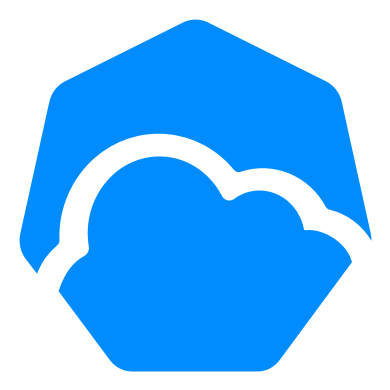
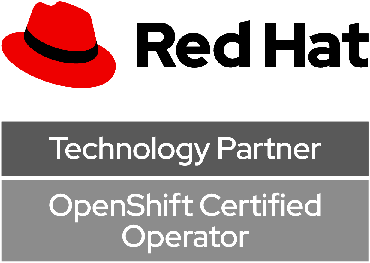

# <a href="https://github.com/spotinst/ocean-operator"></a> Ocean Operator for Kubernetes<a href="https://access.redhat.com/containers/#/docker.io/spotinst/ocean-operator"></a>

**Ocean Operator for Kubernetes** is an [Operator](https://kubernetes.io/docs/concepts/extend-kubernetes/operator/) that makes use of [custom resources](https://kubernetes.io/docs/concepts/extend-kubernetes/api-extension/custom-resources/) and can be used to create and manage Ocean resources in [Spot](https://spot.io/). There is no additional charge to use this Operator. You do incur charges for any Ocean resources that you use through this Operator.

## Table of Contents

- [Installation](#installation)
- [Usage](#usage)
- [Documentation](#documentation)
- [Getting Help](#getting-help)
- [Community](#community)
- [Contributing](#contributing)
- [License](#license)

## Installation

```bash
$ TBD
```

## Usage

First, you must install the Operator. After installation is complete, create a `Cluster` YAML specification by following one of the samples, like [deploy/crds/ocean.spot.io_v1_cluster_cr.yaml](./deploy/crds/ocean.spot.io_v1_cluster_cr.yaml). Then, use `kubectl` to create and manage your resource:

```bash
$ kubectl apply -f ocean.spot.io_v1_cluster_cr.yaml
cluser.ocean.spot.io/example-cluster created
```

## Documentation

If you're new to [Spot](https://spot.io/) and want to get started, please checkout our [Getting Started](https://docs.spot.io/connect-your-cloud-provider/) guide, available on the [Spot Documentation](https://docs.spot.io/) website.

## Getting Help

We use GitHub issues for tracking bugs and feature requests. Please use these community resources for getting help:

- Ask a question on [Stack Overflow](https://stackoverflow.com/) and tag it with [ocean-operator](https://stackoverflow.com/questions/tagged/ocean-operator/).
- Join our [Spot](https://spot.io/) community on [Slack](http://slack.spot.io/).
- Open an [issue](https://github.com/spotinst/ocean-operator/issues/new/choose/).

## Community

- [Slack](http://slack.spot.io/)
- [Twitter](https://twitter.com/spot_hq/)

## Contributing

Please see the [contribution guidelines](.github/CONTRIBUTING.md).

## License

Code is licensed under the [Apache License 2.0](LICENSE). See [NOTICE.md](NOTICE.md) for complete details, including software and third-party licenses and permissions.
